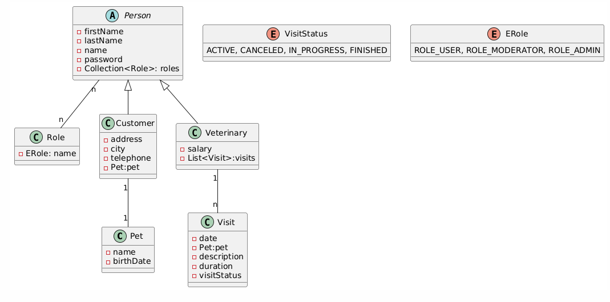

# Proyecto para agendar visitas al veterinario

Es un proyecto sencillo para agendar visitas al veterinario.
Tenemos las entidades Person, Role, Customer, Veterinary, Pet y Visit.
Se pueden crear clientes, veterinarios, mascotas y visitas.
Cuando un veterinario se crea se le pone automáticamente el ROLE_ADMIN.
El veterinario que tiene el ROLE_ADMIN puede actualizar el estado de las visitas
a ACTIVE, CANCELED, IN_PROGRESS, FINISHED.
Se puede obtener el veterinario por id y ver el listado de veterinarios.
Se puede obtener un listado de mascotas o también crear la mascota asociada
al cliente. Solo los veterinarios pueden crear la mascota.
Solo los veterinarios pueden crear clientes.
Hay un login común para todos los usuarios aunque también hay otro para
hacer login exclusivamente para los veterinarios, por defecto usaremos el
de común.


### Diagrama uml:




### Setup:

- Lo primero que debemos hacer es crear el esquema de base de datos llamado "projectveterinary".
- Descomentamos la linea del archivo application.properties de creación de la base de datos.
- Ejecutamos la aplicación para que nos cree las tablas de base de datos.
- Creamos los roles mediante la siguiente ruta "localhost:8080/api/role/generate-roles"
- Necesitamos crear el primer veterinario para ello comentamos la anotación @PreAuthorize
del controller VeterinaryController porque solo los veterinarios deberían dejar crear otros
veterinarios:
```
    @PostMapping("/add-veterinary")
    @PreAuthorize("hasAuthority('ROLE_ADMIN')")
    public ResponseEntity<?> addVeterinary(@RequestBody AuthRegisterVeterinaryDto authRegisterVeterinaryDto) {
```
- Una vez creado el primer veterinario ya podemos descomentar la anotación @PreAuthorize
para que solo los veterinarios puedan crear veterinarios.
- Ya podemos usar la api con normalidad.
- Recordar hacer login y utilizar el token del usuario para probar la api.

### Tecnologías usadas:

- Java
- JPA
- Spring web
- MySql
- Spring security
- lombok
- java-jwt
- IntelliJ Idea
- Maven

### Controllers y rutas:

#### RoleController:

- Generación de roles: "/api/role/generate-roles"

#### VeterinaryController:

- Add veterinary (ROLE_ADMIN): @PostMapping "/api/veterinary/add-veterinary"
- getVeterinaryById (ROLE_ADMIN): @GetMapping "/api/veterinary/{veterinaryId}"
- getVeterinaries: @GetMapping "/api/veterinary/get-veterinaries"

#### CustomerController:

- addCustomer (ROLE_ADMIN): @PostMapping "/api/customer/add-customer"

#### PetController:

- getAllPets: @GetMapping "/api/pet/get-pets"
- addpet (ROLE_ADMIN): @PostMapping "/api/pet/add-pet/{idCustomer}"

#### VisitController:

- updateVisitStatus (ROLE_ADMIN): @PatchMapping "/api/visit/update-visit-status/{visitId}"
- addVisit (ROLER_ADMIN): @PostMapping "/api/visit/add-visit/{idVeterinary}"

### Future work:

Me gustaría mejorar las relaciones porque por simplicidad hice alguna relacion OneToOne
cuando debería haber sido otra.
También me gustaría haber podido haber añadido otras rutas como:

- Listar clientes.
- Actualizar el nombre de una mascota.
- Que el customer pueda actualizar el teléfono.
- Implementar mas tests.

### Resources:

- Almacenamiento de fechas: [Storing date time](https://www.baeldung.com/java-postgresql-store-date-time)
- Lombok: [lombok](https://www.baeldung.com/lombok-builder-inheritance)
- Spring security: [spring-security](https://docs.spring.io/spring-security/reference/servlet/authorization/method-security.html)

### Team members:

- Javier Moneo

### Trello link:

[Trello-proyectoveterinario](https://trello.com/b/Ch5L36pY/proyectoveterinario)

### Presentación:

[Presentación-proyecto-veterinario](https://docs.google.com/presentation/d/e/2PACX-1vTXB7_W25FzCEzzpDgn-sD_oyhNerrsD4FphlYNAQH67nQPB_QBQuj2KmjyQClUsoqDt0uXKpzOUuUY/pub?start=false&loop=false&delayms=3000)